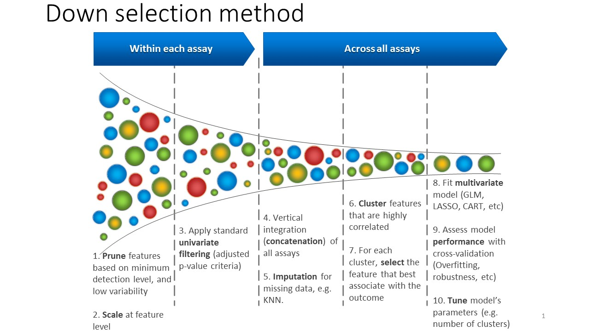
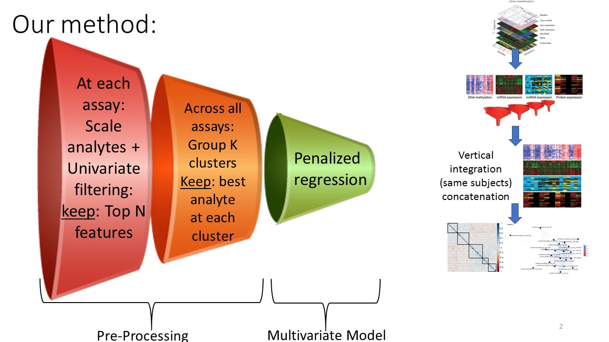
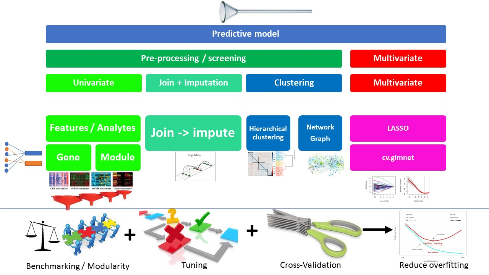
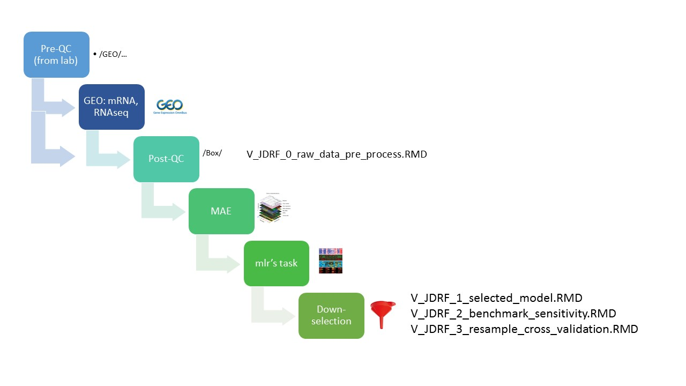

<!-- README.md is generated from README.Rmd. Please edit that file -->

# JDRFCAV

A feature selection method for vertical integrative analysis of
multi-assay genomic data.

Vertical integrative multi-assay genomic data analysis combines multiple
sources of genomic assays (e.g. RNA-seq, CNV, genotyping, methylation)
for the same set of samples. This design increases statistical power and
accuracy.  
For a model-based supervised task with either continuous or categorical
dependent variable, penalized regression approaches are usually employed
to handle both the feature selection step, and the model fitting
evaluation.  
Here we introduce an early screening step, employed prior to the
model-fitting step. For each assay top analytes are selected based on
their univariate association with the dependent variable, followed by an
unsupervised hierarchical clustering across all selected analytes from
all assays. For each cluster, a single representative analyte is
selected. Then a penalized regression based model is fitted to measure
the model’s performance.  
This two-step approach was successfully validated on previously
published multi-assay studies such as the HIV RV144 study. It allows
balanced use of data from assays of different sizes (number of
analytes), and ease interpretation of the results.

Our method implement the
[MultiAssayExperiment](http://bioconductor.org/packages/release/bioc/html/MultiAssayExperiment.html)
R/Bioconductor S4 class for multi-assay data.  
Feature selection methods are implemented via a high-level machine
learning approach with the [mlr](https://mlr.mlr-org.com/)
pacakge.

## Vision:

<!-- --><!-- --><!-- -->

## Installation

``` r
# Install development version from GitHub
devtools::install_github("FredHutch/JDRFCAV")

# TBA: Install release version from CRAN
# install.packages("JDRFCAV")
```

## Usage

[check
vignettes:](https://github.com/FredHutch/JDRFCAV/tree/master/vignettes)

# Data curation

A. NCBI/GEO raw files -\> processed data -\>
[MultiAssayExperiment](http://bioconductor.org/packages/release/bioc/html/MultiAssayExperiment.html)
(MAE) -\> mlr’s
[task](https://mlr.mlr-org.com/articles/tutorial/task.html) foramt
<!-- -->

# Paper’s reproducible results

B. Biomarker discovery:  
B.1 Feature selection: Fun\_lrn\_univ\_only\_makePrep\_MaG,
Fun\_lrn\_univ\_Clusters\_All\_makePrep\_MaG  
B.2 Sensitivity analysis

# Customized Multi-assay feature selection

C. (TBA) UnivCPO, UnivClustCPO (refactoring the above
makePreprocWrapper() )

## About

Fred Hutch  
Benaroya Research Institute  
JDRF

## Github site creation

[Dror Berel](https://drorberel.github.io/)
